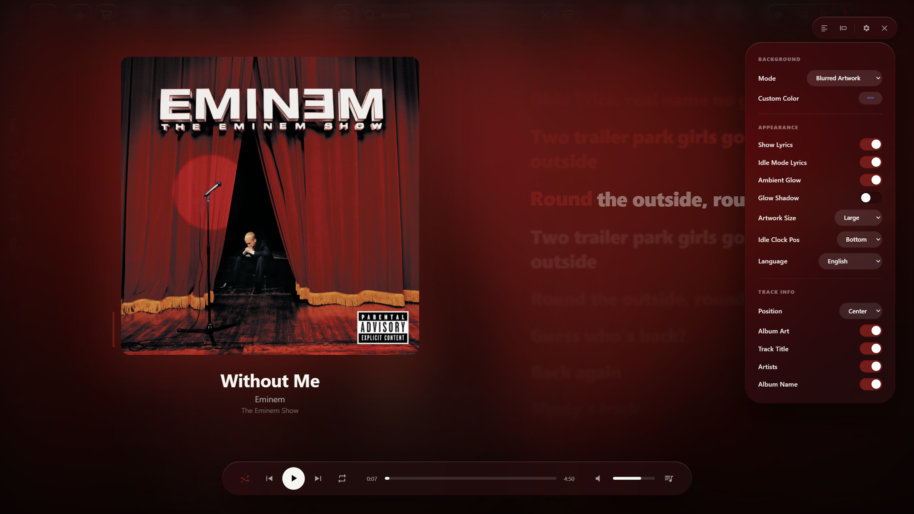

# 🎵 Fullscreen Reloaded — Spicetify Extension

> A premium Apple TV / Vision OS–inspired Spotify fullscreen experience with Liquid Glass design.



---

## ✨ Features

### 🎨 Background Modes
| Mode | Description |
|------|-------------|
| Solid | Plain dark background |
| Gradient | Soft gradient derived from album colors |
| Dynamic Gradient | Live color transitions on track change |
| Blurred Artwork | Blurred album art as background |
| Artwork | Full-resolution cover art background |
| Darkened Artwork | Darkened cover art overlay |
| Custom Color | Pick any color you want |

### 🎤 Lyrics
- Spotify's native lyrics + LRCLIB as fallback provider
- **Word-synced:** Highlights word by word in real time
- **Line-synced:** Highlights line by line
- **Unsynced:** All lyrics displayed cleanly, not clickable
- Click any synced lyric line to seek to that moment
- First line is visible before the song's first timestamp
- **Smooth scrolling** — silky auto-scroll follows the active line
- "Resume Sync" button to re-enable auto-scroll after manual scrolling
- No lyrics found → album art centers automatically
- Lyrics truly unavailable → 🎵 **Instrumental Animation** (animated equalizer bars)
- `♪` / `🎶` lines → large bouncing music note icon

### 🎛️ Bottom Bar (Liquid Glass)
- Shuffle, Previous, Play/Pause, Next, Repeat controls
- Click or drag the progress bar to seek
- Volume via scroll wheel ±5% on the volume area
- Volume bar click & drag support
- Queue button

### 📺 Picture-in-Picture (PiP)
- Hit the PiP button in the top bar to float the album art in a mini window
- PiP image updates automatically when the track changes
- Press again to close PiP

### 🌐 Multilingual UI (i18n)
- Full **English** 🇬🇧 and **Turkish** 🇹🇷 support
- **Auto mode:** Follows Spotify's own language setting
- Manually override from Settings at any time

### 🌙 Idle (Cinema) Mode
- Activates after ~3 seconds of no mouse movement
- Album art centers and enlarges
- Clock appears (Top or Bottom position configurable)
- Any mouse movement returns to normal mode

### ⏰ Clock
- Shown during idle mode
- Configurable position: Top / Bottom
- Large, legible font with tabular numerals

### 🃏 Up Next Card
- Appears in the bottom-right corner as the current track nears its end
- Shows the next track's title, artist, and album art
- Click to skip to the next track

### 🖼️ Album Artwork
- Roundness (border radius) setting
- Size: Small / Medium / Large
- Ambient glow toggle
- Drop shadow toggle
- Dual-layer crossfade animation on track change

### ℹ️ Track Info
- Position: Left / Center / Right
- Toggle Album Art visibility
- Toggle Track Title visibility
- Toggle Artists visibility (multi-artist tracks fully supported)
- Toggle Album Name visibility

---

## 📦 Installation

1. Make sure [Spicetify](https://spicetify.app/) is installed
2. Place this file in your `Extensions` folder:
   ```
   %APPDATA%\spicetify\Extensions\fullscreen-reloaded.js
   ```
3. Run in terminal:
   ```powershell
   spicetify config extensions fullscreen-reloaded.js
   spicetify apply
   ```

---

## ⌨️ Usage

| Action | Description |
|--------|-------------|
| Click the fullscreen icon in Spotify | Open fullscreen mode |
| `Esc` | Close fullscreen mode |
| Scroll wheel (on volume area) | Volume ±5% |
| Click a lyric line | Seek to that moment (synced tracks only) |
| PiP button | Open / close floating mini window |
| Gear button | Open Settings panel |

---

## 🛠️ Settings

Click the **⚙️ gear** button in the top-right pill to access all settings:

- **Background** — Mode, custom color
- **Appearance** — Lyrics toggle, ambient glow, shadow, artwork size, clock position, language
- **Track Info** — Position, which fields are visible

---

## 📋 Requirements

- Spicetify 2.x+
- Spotify Desktop (Windows / macOS / Linux)
- Chromium-based Spotify engine (required for PiP)

---

## 🎨 Design Philosophy

> *"It should feel like staring at an Apple TV screen."*

Every UI element is designed around the **Liquid Glass** aesthetic:
- `backdrop-filter: blur(60px)` frosted glass effect
- Subtle `inset box-shadow` for depth and surface feel
- `border-radius: 999px` pill-shaped containers
- Dynamic color palette extracted from album artwork
- 60fps smooth animations via `requestAnimationFrame`
